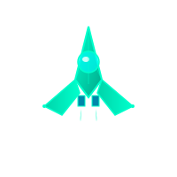
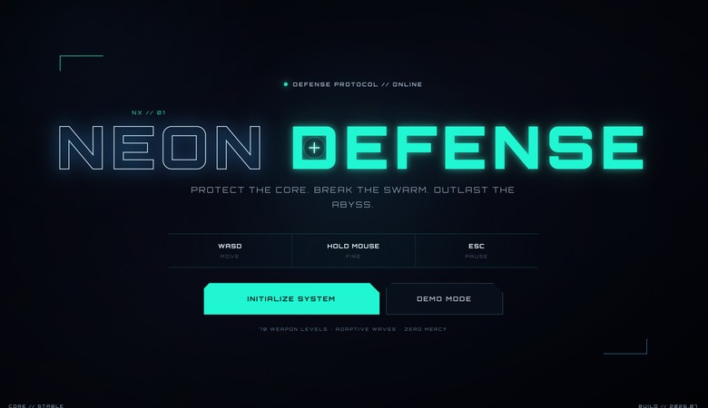
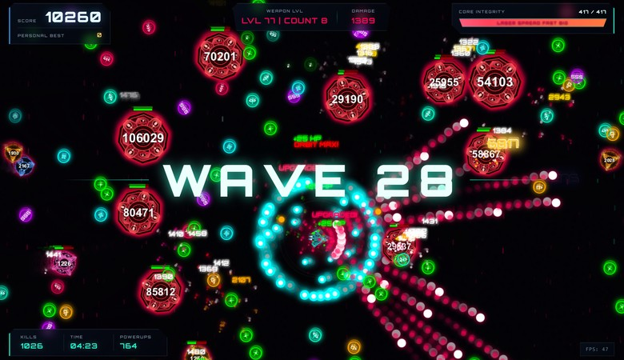

<h1 align="center">
  
  <br>
  Neon Abyss: Core Defense
  <br>
</h1>

<h3 align="center">
A cyberpunk-themed top-down arcade shooter built with vanilla JavaScript and HTML5 Canvas.
</h3>

<p align="center">
  <a href="./README.md">English</a> ·
  <a href="./README.zh-CN.md">中文</a>
</p>

<p align="center">
  
  
  
</p>

## Overview

Neon Abyss: Core Defense is a fast-paced 2D bullet-hell defense game set in a neon-drenched cyberpunk world. You control an advanced combat spacecraft, fending off relentless waves of enemies that grow stronger as your score climbs. Destroy enemies, collect power-ups, and upgrade your weapons through **70 laser levels** to survive as long as possible.

**Zero dependencies. No build tools. No npm install. Just open and play.**

## Preview

<p align="center">
  
  &nbsp;
  
</p>

## Gameplay

### Controls

| Key | Action |
|-----|--------|
| `W` `A` `S` `D` | Move the ship |
| **Hold** Mouse | Auto-fire toward cursor |
| `ESC` | Pause / Resume |

### Features

- **70-Level Laser Upgrade System** — Weapons evolve through 7 color tiers (Gray → White → Green → Blue → Purple → Orange → Red), each with 10 saturation substeps, dynamically scaling damage and visuals.
- **Multi-Shot Spread Fire** — Expand from single shots up to 8 simultaneous bullets in a fan pattern.
- **Bullet Size Growth** — 70 levels of progressive bullet enlargement.
- **Orbiting Bullet System** — Up to 50 rotating projectiles that orbit your ship, dealing continuous damage to enemies that get too close.
- **Critical Hit System** — 5-tier crit system (2×, 4×, 6×, 8×, 10× damage) with escalating visual effects including screen shake, golden explosions, and rainbow ultra-crit floating text.
- **3 Enemy Types** — Normal chasers, Shooters that fire back, and Giant brutes that appear every 100 kills with increasing numbers.
- **6 Power-Up Types** — Health restore, Shot Count, Bullet Size, Damage (Laser Level), Fire Rate, and Orbit Bullets.
- **Screen Shake & Particle Effects** — Explosions, trails, and impact feedback.
- **Procedural Audio** — All sound effects and background music generated in real-time via the Web Audio API — no audio files needed.
- **Demo Mode** — Watch an AI pilot your ship with evasion, targeting, and pickup-collection logic.
- **Auto-Pause** — Game automatically pauses when the browser window loses focus.

## Quick Start

### Play Online

Open the game directly in your browser — no server required.

1. Clone the repository:
   ```bash
   git clone https://github.com/RISEN-B/Neon-Abyss-Core-Defense.git
   ```
2. Open `index.html` in any modern browser.
3. Click **"Initialize System"** to start, or **"Demo Mode"** to watch the AI play.

> Alternatively, serve it with any static HTTP server:
> ```bash
> python3 -m http.server 8000
> # then visit http://localhost:8000
> ```

### Browser Compatibility

Works in all modern browsers with Web Audio API support (Chrome, Firefox, Safari, Edge).

## Project Structure

```
Neon-Abyss-Core-Defense/
├── index.html                    # Main entry point
├── LICENSE                       # GNU GPL v3
├── README.md
├── README.zh-CN.md
└── assets/
    ├── css/
    │   ├── base.css              # Global reset & layout
    │   ├── cursor.css            # Custom crosshair cursor
    │   ├── hud.css               # Score, health bar, weapon display
    │   ├── game-states.css       # Pause menu, game over overlay
    │   └── start-screen.css      # Title screen with glow animation
    ├── js/
    │   ├── config.js             # Game constants & laser color system
    │   ├── audio-manager.js      # Procedural audio engine (Web Audio API)
    │   ├── player.js             # Player class (movement, shooting, upgrades, demo AI)
    │   ├── projectile.js         # Projectile class with critical hit system
    │   ├── enemy.js              # Enemy class (normal, shooter, giant)
    │   ├── powerup.js            # Power-up class (6 types)
    │   ├── particles.js          # Particle, FloatingText, BackgroundParticle classes
    │   ├── utils.js              # Utility functions (spawning, explosions, game state)
    │   ├── game-loop.js          # Main 60fps game loop & collision detection
    │   └── main.js               # Initialization, event listeners, state management
    └── svg/
        ├── player.svg            # Player spaceship sprite
        ├── enemy-normal*.svg     # Normal enemy sprites (4 color variants)
        ├── enemy-shooter.svg     # Shooter enemy sprite
        └── enemy-giant.svg       # Giant enemy sprite
```

## Architecture

The game runs on a single `requestAnimationFrame` loop (`game-loop.js`) at ~60 FPS. Each frame:

1. Clears the canvas with a translucent overlay for a motion-trail effect
2. Updates and draws: Background particles → Player → Projectiles → Enemies → Power-ups → Orbiting bullets → Explosion particles → Enemy projectiles → Floating damage text
3. Handles collision detection between all entity pairs
4. Scales difficulty based on score (`difficultyMultiplier`)

All game audio is synthesized at runtime using the Web Audio API's `OscillatorNode` and `GainNode` — no external audio files are loaded.

## Upgrades & Progression

| Power-Up | Symbol | Effect |
|----------|--------|--------|
| **HEALTH** | `+` | +25 HP, +1 max HP, +1 permanent damage |
| **COUNT** | `<<>` | +1 bullet per shot (max 8) |
| **SIZE** | `O>` | +1 bullet size level (70 levels) |
| **DAMAGE** | `>>>` | +1 laser level (70 levels, affects color & damage) |
| **RATE** | `SSS` | -1 frame shoot cooldown (min 6) |
| **ORBIT** | `◎` | +1 orbiting bullet (max 50) |

Every power-up collected (including HEALTH) permanently increases base damage by +1 via the `powerupCount` stat.

## License

Neon Abyss: Core Defense is free software licensed under the **GNU General Public License v3.0**. See [LICENSE](LICENSE) for the full text.

```
Copyright (C) 2026  RISEN-B

This program is free software: you can redistribute it and/or modify
it under the terms of the GNU General Public License as published by
the Free Software Foundation, either version 3 of the License, or
(at your option) any later version.

This program is distributed in the hope that it will be useful,
but WITHOUT ANY WARRANTY; without even the implied warranty of
MERCHANTABILITY or FITNESS FOR A PARTICULAR PURPOSE.  See the
GNU General Public License for more details.
```

## Contributors

|  | Contributor | Role |
|--|-------------|------|
|  | [**RISEN-B**](https://github.com/RISEN-B) | Game architecture & core gameplay framework |
|  | [**aWazINg7**](https://github.com/aWazINg7) | Visual identity, stylistic direction & feature design |
|  | [**crazyn2**](https://github.com/crazyn2) | Promotion & highlight curation |
|  | [**kute1654**](https://github.com/kute1654) | Performance optimization & detail refinement |

---

<p align="center">
  <sub>Built with ❤️ and vanilla JavaScript. No frameworks were harmed in the making of this game.</sub>
</p>
